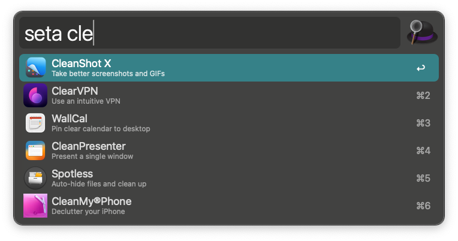

# Alfred SetApp Search
Search SetApp Applications via Alfred

SetApp is a paid subscription service that gives you access to **260+ Mac / iOS** apps
This workflow allows you to search/filter the apps included in SetApp
and open the app page in your browser or open the app if installed.

The apps main features include:
---
* Fetches icons and app information from included JSON file
* Search/filter all the apps currently listed as included
* Open page in browser about selected app
* Open DeepLink of app using UID ie: **setapp://launch/12345**
* ⇧ - If app is installed alfred will just open the selected app.
* ⇧ - If app Not installed show the information/install page in SetApp application.
* ⌘ - show the platforms this app works on
* ⌥ - show the Rating of the selected app
* ⌘+⌥ - Show both the Platforms and the ratings
---
* Workflow currently uses hardcoded apps.json file I formatted from their site: https://setapp.com/apps
* TODO - make JSON file download via an API or some other way rather than including in workflow.
* TODO - filter by platform ie. iOS | MacOS 
* TODO - sort by rating ie. percentage out of 100

---
Don't have SetApp? Use this link for 1 Month Free to try it / subscribe:
https://go.setapp.com/invite/ttyd3ssu

SetApp is produced/owned by MacPaw - https://setapp.com

This workflow is under the MIT License.

I have found many of the apps in SetApp extremely useful.

### CDoug
