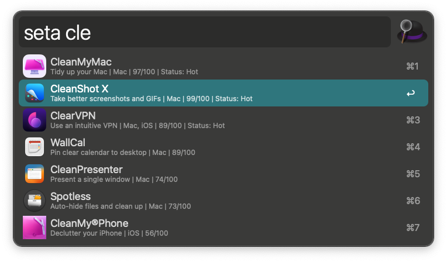

# SetApp Search for Alfred

[](https://github.com/cdouglasnet/alfred_setapp_search/actions/workflows/ci.yml?query=branch%3Amain)
[](https://github.com/cdouglasnet/alfred_setapp_search/actions/workflows/ci.yml?query=branch%3Adev)
[](https://github.com/cdouglasnet/alfred_setapp_search/releases)
[](requirements.txt)
[](https://www.alfredapp.com/)
[](LICENSE)

Search SetApp Applications via Alfred


SetApp is a paid subscription service that gives you access to **260+ Mac / iOS** apps
This workflow allows you to search/filter the apps included in SetApp
and open the app page in your browser or open the app if installed.



The apps main features include:
---
* Fetches icons and app information from included JSON file
* Search/filter all the apps currently listed as included
* Open page in browser about selected app
* Open DeepLink of app using UID ie: **setapp://launch/12345**
* ⇧ - If app is installed alfred will just open the selected app.
* ⇧ - If app Not installed show the information/install page in SetApp application.
* ⌘ - show the platforms this app works on
* ⌥ - show the Rating of the selected app
* ⌘+⌥ - Show both the Platforms and the ratings

# Setting Up Your Environment and Building The Project

## Prerequisites
- Python 3.9 or higher
- Node.js (for build tools)

## Python Environment Setup

1. **Create a virtual environment:**
   ```bash
   python3 -m venv .venv
   ```

2. **Activate the virtual environment:**
   ```bash
   source .venv/bin/activate
   ```

3. **Install Python dependencies:**
   ```bash
   pip install -r requirements.txt
   ```

## Running Tests

Once the environment is set up, you can run the test suite:

```bash
.venv/bin/python3 -m pytest tests/ -v
```

## Building the Workflow

The project uses Gulp for building. Install Node.js dependencies and build:

```bash
npm install
npm run build
```

## Initial App Data Scrape Setup

The workflow now includes an initial scraper setup to convert SetApp HTML app listings into workflow JSON.

1. Place/update source HTML at `src/data/apps_temp.html`
2. Run the scraper:

```bash
python3 src/script/scrape_apps_temp.py
```

This generates `src/data/apps_scraped.json` in workflow format:

```json
{
  "items": [
    {
      "uid": 742,
      "title": "Supercharge"
    }
  ]
}
```

## Version Change Summary

### v0.0.0.1
- 🧾 Added app details view in Alfred Text View.
- 🔁 Passed app data as Alfred variables.
- 🖼️ Improved cached icon/details display.
- 🛠️ Added setup and build steps to the README.

### v0.0.0.2
- ✨ Added support for `status` and `ai` fields.
- 🧠 Included AI/status text in result subtitles and search matching.
- 📦 Added Alfred variables: `setapp_status` and `setapp_ai`.
- 📄 Updated Text View details to show AI+ status.
- 🔖 Bumped workflow version to `0.0.0.2`.

### v0.0.0.3
- 🆕 Added 30 new apps to the dataset.
- 🤖 Added initial auto-scrape setup to convert app HTML into JSON.
- 🧱 Scraper output now matches workflow format with top-level `items`.

---
* Workflow currently uses hardcoded apps.json file I formatted from their site: https://setapp.com/apps
* TODO - make JSON file download via an API or some other way rather than including in workflow.
* TODO - filter by platform i.e. iOS | macOS 
* TODO - sort by rating i.e. percentage out of 100

---
Don't have SetApp? Use this link for 1 Month Free to try it / subscribe:
https://go.setapp.com/invite/ttyd3ssu


SetApp is produced/owned by MacPaw - https://setapp.com

This workflow is under the MIT License.

I have found many of the apps in SetApp extremely useful.

### CDoug
